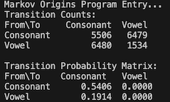

# Markov Chains Original Study

This program replicates Andrey Markov’s original statistical analysis of Eugene Onegin by modeling letter sequences in the text as a two-state Markov chain: vowels and consonants.

To demonstrate how letter transitions in natural language are not independent, using a simple C++ simulation that:
	•	Converts text to vowel/consonant states
	•	Counts transitions between those states
	•	Builds a 2×2 transition matrix
	•	Outputs empirical transition probabilities

## Features
	1.	Input: A plain text file (pushkin_eugene_onegin.txt) containing alphabetic text.
	2.	Preprocessing:
		•	Non-letter characters are ignored
		•	All letters are converted to lowercase
	3.	State Mapping:
		•	Vowel = 1: a, e, i, o, u, y
		•	Consonant = 0: All other letters
	4.	Transition Count:
		•	Tracks how often each type of letter is followed by another
	5.	Output:
		•	A count matrix of transitions
		•	A normalized transition probability matrix


## Project Files
- `main.cpp` – Main Program
- `markov_functions.h` - Program Functions

## Build
```
/project-root/
├── main.cpp                   // Main C++ program
├── markov_functions.h         // Functions
├── pushkin_eugene_onegin.txt  // Sample input file (text from Eugene Onegin)
└── README.md                  // This file
```

### If building for the first time, from the build folder, execute -> cmake ..

### macOS/Linux
mkdir build
cd build
cmake ..
../build.sh

## Run
### macOS/Linux from repo root dir:
```
./build/MarkovOrigins
```

### Windows (if using MinGW/GLFW there)
Executable name `MarkovOrigins` in `build/`.


## Example Output

